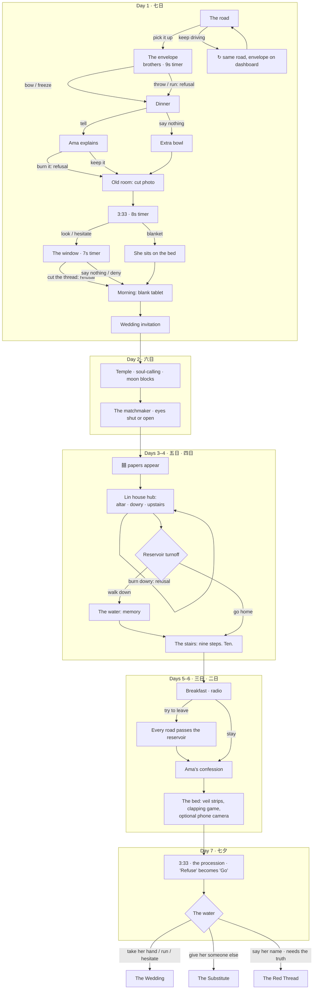

# 紅包 · The Red Envelope — Game Design Document

> A Taiwanese folk-horror visual novel for the browser.
> Seven days of Ghost Month. A ghost marriage you cannot refuse. A reservoir that will not stop rising.

| | |
|---|---|
| **Genre** | Narrative horror visual novel, branching, 3 endings |
| **Platform** | Desktop and mobile browsers. Static HTML/CSS/JS, no build step, no assets. Hosted on GitHub Pages |
| **Length** | ~60–90 minutes for one playthrough; 3 endings reward replays |
| **Audience** | Adults who like slow, psychological horror (*Detention*, *Saya no Uta*, *Doki Doki Literature Club*, *Slay the Princess*) |
| **Tone** | Dread over shock. Grief under the fear. Nothing is ever explained out loud. |
| **Status** | Complete: Days 1–7, all endings, playtested end to end |

---

## Contents

1. [High concept](#1-high-concept)
2. [Design pillars](#2-design-pillars)
3. [Story](#3-story)
4. [Characters](#4-characters)
5. [Structure and flow](#5-structure-and-flow)
6. [Day-by-day breakdown](#6-day-by-day-breakdown)
7. [Endings](#7-endings)
8. [Core systems](#8-core-systems)
9. [Horror toolkit](#9-horror-toolkit)
10. [Art direction](#10-art-direction)
11. [Audio design](#11-audio-design)
12. [UI and UX](#12-ui-and-ux)
13. [Cultural grounding](#13-cultural-grounding)
14. [Technical design](#14-technical-design)
15. [Writing guide](#15-writing-guide)
16. [Playtesting history](#16-playtesting-history)
17. [Known limitations and roadmap](#17-known-limitations-and-roadmap)

---

## 1. High concept

It is the first day of the seventh lunar month, Ghost Month, when the gates of the underworld open. A-Wei, 26, drives home to his grandmother's village outside Tainan for the first time in three years. On a mountain road, lying perfectly dry in the pouring rain, is a red envelope. Inside: banknotes, a lock of wet hair, and a dead girl's name and date of death.

Picking it up means he has accepted a **ghost marriage** (冥婚). The wedding is in seven days.

Every refusal quietly erases one of his family from existence, and nobody notices. Meanwhile the reservoir outside the village rises a little every day, toward the house, toward him. The player's job is not to escape. It is to find out why *he* was chosen, and whether anything is owed.

**The hook in one line:** *a horror game about the thing you forgot, where the only way out is to remember.*

---

## 2. Design pillars

Every feature is judged against these five pillars. If a feature doesn't serve at least one, it goes.

### 2.1 Something huge is coming, and it is beyond your control
The spine of the game. Like the moon in *Majora's Mask*, the threat is always visible, grows every day, and the world reacts to it. Our moon is the **reservoir**: it rises every morning on the radio, visibly floods the scenes, and on the last night the water comes up to meet you. The countdown, the red thread, the undertow drone and the choices that rewrite themselves all push the same feeling: it is coming, and you cannot stop it.

### 2.2 Show less
Playtesting proved it: the scariest scene in the game shows nothing at all (the bedroom at 3:33). Full reveals of the bride failed. So she is **only ever glimpsed**: a hand on the glass, veil strips hanging over your face, fingertips at a wardrobe door, a face-detect box locked onto empty darkness. Sound and text carry the fear. Darkness is the default.

### 2.3 Dread, then the drop
Tension is built slowly, with silence, sound and false relief, and paid off with a **sudden** scare, not a slow fade. The game never uses stingers to *manufacture* a scare. It earns one, then lands it all at once.

### 2.4 Complicity
The horror is personal. The player's choices cost real things: family members, silently. The game never announces the cost. The discovery (an empty chair, a name gone from the Log, a photo on the wall with one fewer person in it) is the punishment.

### 2.5 It follows you out
The game should stay uncomfortable after it's closed. The wedding invitation is dated on the player's real calendar. The countdown keeps running on the title screen. Her texts arrive while you're away. The tab icon becomes her face when you look away.

---

## 3. Story

### 3.1 The surface story
A-Wei returns home for Ghost Month, picks up a red envelope, and is claimed as a groom by a dead girl, Lin Qiu-Yue, and her three dead brothers. Over seven days he visits the village temple, the abandoned Lin house and the reservoir, while the wedding preparations happen around him without anyone admitting to making them.

### 3.2 The truth (revealed across the whole game)
Twenty years ago, on the first day of Ghost Month, six-year-old A-Wei and seven-year-old Qiu-Yue sneaked down to the reservoir. They had played "wedding" that morning and tied a red thread between their little fingers so he wouldn't get lost in the tall grass.

A-Wei waded in. Something in the water, a drowned thing looking for its substitute (抓交替), took hold of him. Qiu-Yue pulled him out, then slipped and went under herself. She held on to his hand. **He let go.**

He was found on the bank with a fever and no memory. His grandmother, Ama, knew. She paid the temple keeper to call his soul back and make him forget, and never told the Lin family he'd been there. Qiu-Yue became the water's substitute. Her three brothers died within a year.

She isn't choosing a husband at random. She is collecting what she is owed.

### 3.3 How the truth is seeded
The game never delivers an exposition dump. The truth arrives in fragments, in order of intimacy:

| Where | What the player learns |
|---|---|
| Day 1, road | He has always held his breath past the reservoir turnoff, and never knew why |
| Day 1, envelope | The hair is wet and smells of pond water. A memory flash: *"hold on, A-Wei, hold on to me"* |
| Day 1, dinner | Ama drops her spoon at the name. Mom: "Ma. Don't." |
| Day 1, bedroom | A photo of him at six by the reservoir, holding a hand. The girl has been cut out |
| Day 1, window | *"You held my hand so tight. And then you let go."* |
| Day 2, temple | The rice in the soul-calling cup shows a small handprint. The keeper remembers a feverish boy whose fist wouldn't open |
| Day 3, Lin house | The other half of the photograph: her, holding a hand that has been cut off at the wrist |
| Day 3, reservoir | The full memory. He let go because he was afraid |
| Day 5, Ama | Her confession, if she survived and you've started to find the truth |
| Day 7, true ending | You say her whole name, apologize, and bring her home as family |

---

## 4. Characters

### The living (paper cut-outs with gentle painted faces)
| Character | Role | Arc |
|---|---|---|
| **A-Wei** (you) | 26, works in Taipei, hasn't been home in three years. There's "a room in that house he's forgotten about" | From denial to memory. Every choice is either running from the past or turning to face it |
| **Ama** (阿嬤) | Grandmother, 81. Red peony blouse, round glasses | Knows everything. Protects him with a temple charm. Confesses on Day 5 if she survives. First to be erased |
| **Mom** (媽) | Warm, practical, keeps the family together | Increasingly drawn into preparations she doesn't remember making ("Yours. For Saturday."). Last to be erased |
| **Xiao-Wen** (小雯) | 14, little sister. Folds paper ingots, complains about school | The innocent who *sees*: "The girl who sits at the end of the table. She never gets anything." Her paper ingot outlives her memory |
| **The Temple Keeper** | Thin old man, village temple | Performed the forgetting twenty years ago. Gives the player the rules and points them to the Lin house |

### The dead (funeral effigies: blank white eyes, rouge, bamboo showing through torn paper)
| Character | Role |
|---|---|
| **Lin Qiu-Yue** (林秋月) | The bride. Seven years old forever, in a wedding dress too big for her. Never fully seen. Tender and terrifying in the same breath |
| **The three brothers** | Paper servants in soaked suits, painted smiles. They deliver the envelope, collect the groom, and speak for the family: "Congratulations, son-in-law." |
| **The Matchmaker** | Paper old woman with a red flower and a fan. Comes on Day 2 to measure the groom. Never seen |

---

## 5. Structure and flow

The game is **seven days**, each ending in a night. Branches rejoin at every day boundary; what persists is *state* (who's still alive, what you've learned, what you've done).

### Countdown
| Story day | Countdown seal | Reservoir (radio) |
|---|---|---|
| Day 1 | 七 → 六 | — |
| Day 2 | 六 | +4 cm overnight, no rain upstream |
| Day 3 | 五 | +11 cm; stay away from it this month |
| Day 4 | 四 | Sluice gates opened; still rising |
| Day 5 | 三 | Road past it closed; water in the paddy fields |
| Day 6 | 二 | Not mentioned. The lane is ankle-deep |
| Day 7 | 〇 | Every station plays only the suona |

---

## 6. Day-by-day breakdown

Each day has a **purpose**, a **comfort beat** (something warm to lose), a **set-piece** (almost always a listening scene at night), and a **question** it leaves the player with.

### Day 1 · 七日 — The Envelope
- **Purpose:** establish the family, the rules of Ghost Month, and the mechanic of silent erasure.
- **Comfort:** the phone call home, Ama fussing, Xiao-Wen's forty gold ingots, dinner.
- **Set-pieces:**
  - *The road:* a shrine with steaming soup, ghost money plastering the windshield, the envelope dry in the rain. Driving on loops you back (the only choice becomes "Pick it up / Pick it up").
  - *The brothers:* the rain stops all at once; slow, wet clapping behind you; you turn around. 9-second timer; freezing counts as accepting.
  - *Dinner:* either Ama explains minghun while closing the shutters one by one, or the extra bowl with chopsticks upright. If you refused on the road, Ama vanishes mid-dinner in front of you.
  - *3:33 (the scene that defined the game):* the frogs stop. A footstep. Another. Nothing for a long time. *Tap.* Look (a hand slaps the glass) or hide (it comes in, sits on your bed, ties the thread).
- **Ends on:** a blank tablet on the altar and a wedding invitation dated six real days from now.

### Day 2 · 六日 — The Temple
- **Purpose:** the first adult who knows. The rules of the other side.
- **Comfort:** the temple is "the first place in two days where you feel safe."
- **Set-pieces:**
  - *收驚 soul-calling:* the keeper calls your name into each ear. The rice sinks into a small handprint: "That isn't yours."
  - *Moon blocks:* ask to refuse (laughing blocks, three times) or ask who she was (a yes, and her story).
  - *The matchmaker (listening scene):* a suona approaching from far to near; paper feet in the courtyard; something light on the roof tiles; the latch lifts. Eyes shut, she measures you in total darkness. Open your eyes and the room is empty, a wet dent on the pillow, a voice from under the bed.
- **Question:** what did the old woman pay to make you forget?

### Days 3–4 · 五日 · 四日 — The Lin House and the Stairs
- **Purpose:** the other family. The other half of the photograph. The water.
- **Comfort:** morning, family, ordinary radio. Undercut by 囍 papers nobody pasted and Xiao-Wen's pricked fingers from sewing in her dreams.
- **Set-pieces:**
  - *The Lin house (exploration hub):* altar, dowry, upstairs, in any order. Upstairs, something copies your footsteps "a moment behind, like a child." Wet child's footprints lead to the bed and not away. The paper maid's head has turned toward the stairs.
  - *The reservoir (optional):* the moon is in the water and not in the sky. The full memory returns.
  - *The stairs (listening scene):* her text: *i'm in the house*. "The stairs in Ama's house have nine steps." One creak at a time… Nine. Nothing. *Ten.* Open the door and your phone camera's face detection locks onto the empty dark: **FACE 1**.
- **Question:** what was that at the bottom of the stairs?

### Days 5–6 · 三日 · 二日 — The Water Comes
- **Purpose:** escalation beyond the personal. The world is going under.
- **Comfort:** breakfast, congee, the weather report ("You hold on to them").
- **Set-pieces:**
  - *Breakfast:* a debt from the Lin house is collected on screen; an empty chair; congee going cold.
  - *The escape attempt:* every road runs past the reservoir. The only sign on the road now says 1 KM. The sedan chair floats on the drowned road. "Drive through the water" rewrites itself to "Turn back."
  - *Ama's confession* (if alive and you've found any truth): "I thought that was enough. It wasn't enough, was it."
  - *The banquet:* seven chairs laid in the flooded courtyard, chopsticks upright. Nobody else sees it.
  - *The bed (listening scene):* water drips on your pillow; breathing above your face; wet paper strips brush your cheek. She wants to play the clapping game. Or you hold up your phone camera, it finds nothing, you lower it, and then **FACE 1**.
- **Question:** is there anything left to protect?

### Day 7 · 七夕 — The Procession
- **Purpose:** the wedding.
- **Setup:** 七夕 is the lovers' festival, and the birthday of 七娘媽, who watches over children until sixteen. "Lin Qiu-Yue never turned sixteen." Every radio station plays the suona.
- **Set-piece:** at 3:33 the frogs stop, and so does the undertow drone the player has heard for six days. The suona comes up the road. The lights go out room by room. Three knocks. "Refuse to go" rewrites itself to "Go with them." You don't walk far: the water has come to meet you.

---

## 7. Endings

| Ending | How | What happens | Theme |
|---|---|---|---|
| **The Wedding** 結婚 | Take her hand, press Run (it becomes "Take her hand"), or let the 12-second timer run out | "This time, you don't let go." You walk into the water together. Next morning the tablet bears two names | Paying the debt with yourself |
| **The Substitute** 抓交替 | Give her someone else | She takes the envelope without touching you. A month later there's a red envelope in the gravel and a car ahead of you slows down. You do nothing | Passing the cost on. The bleakest ending |
| **The Red Thread** 紅線 | Only offered if you **remembered** at the reservoir **and** did at least one of: asked the temple who she was, took the photograph, or apologized to her | You say her whole name, confess, and offer her a place on your altar as family. A water lantern with her name drifts to your feet. She unties the thread. Everyone who was erased comes back | Remembering is the only redemption |

The final screen shows endings found (`x of 3`) with the hint "Some of them need you to remember." The title screen changes to reflect the last ending.

---

## 8. Core systems

### 8.1 Silent erasure (refusal debt)
- Each **refusal** (throwing or running from the envelope, burning it, cutting the thread, burning the dowry) adds one **debt**.
- Debts are **collected on screen, later**: at the dinner table, through the smoke, overnight, at breakfast. Order is fixed: **Ama → Xiao-Wen → Mom**.
- On collection, the person is removed between one line and the next, with no fade and no sound. Their seat becomes an **empty chair**; the wall photo is redrawn without them; the conversation continues.
- The erased are retconned: Mom says "Your Ama would have known. God rest her" minutes after Ama spoke; Mom sets out "two bowls. Just two. Like always."
- **Keepsakes outlive memory:** Xiao-Wen's ingot stays in your pocket after she's gone ("A child made this. You don't know who.").
- **The Log forgets:** past lines by an erased person lose their name, and every mention of them becomes "someone".
- The true ending restores everyone.

### 8.2 Truth tracking
Four flags make up the truth: `askedWho` (temple), `foundHalf` (Lin house photo), `remembered` (reservoir), `apologized` (Day 6). They gate Ama's confession, the "I'm sorry" option, and the true ending.

### 8.3 Timed choices
Peak moments get a draining red bar and a faster heartbeat. **Hesitation is a choice**, and it is always the one the dark wants: freezing accepts the brothers; hesitating at 3:33 walks you to the window; hesitating at the wedding takes her hand.

| Where | Time | If you hesitate |
|---|---|---|
| The brothers (Day 1) | 9s | Frozen, then accepted |
| 3:33 (Day 1) | 8s | "Your legs chose." You look |
| The window (Day 1) | 7s | Say nothing |
| The matchmaker (Day 2) | 9s | Eyes stay shut |
| The stairs (Day 4) | 9s | Stay in bed |
| The bed (Day 6) | 9s | Lie still |
| The procession (Day 7) | 10s | Go with them |
| The wedding (Day 7) | 12s | The Wedding |

### 8.4 Choices that rewrite themselves
A `morph` choice retypes its own label after a delay, or the instant the cursor touches it, and changes where it leads. Used exactly three times, at the moments of greatest powerlessness:

- "Drive through the water" → "Turn back"
- "Refuse to go" → "Go with them"
- "Run" → "Take her hand"

If the player clicks before the morph, the story takes over anyway ("'I won't go,' you say. What comes out of your mouth is 'I'll go.'").

### 8.5 Her messages (one-way obsession)
From dinner on Day 1, Qiu-Yue texts you. You cannot reply.

- **Reading feeds her.** Opening the thread marks messages *Seen* and she writes back within seconds ("you read it", "don't close it").
- **Ignoring her escalates the tone, not her.** Unread messages turn needy ("why don't you answer", "i can see the light from your window"), then collapse into bursts of "A-Wei".
- **Attention** rises when you read (+2) or answer calls (+5), decays by 1 every 40s while the phone is closed, and speeds up how often she writes and whether she calls.
- **Calls:** an incoming-call card slides in over the story. Decline, answer or let it ring out. She sometimes calls straight back.
- **She writes while you're away:** about one message per 20 minutes of real time, up to 60, timestamped in the past. The title screen shows the unread count.
- **Scripted texts** mark each day: "six", "five days. i can't sleep either", "four", "the water is almost at your door", "tomorrow", "i'm wearing it now".
- The story notices: the phone walks itself off the desk; at the window she says either "You always look when I write to you" or "You didn't read my messages."

### 8.6 The unease director
A background system that fires quiet, unexplained events while you read, chosen to fit the current scene and never acknowledged by the text. It fires every 22–52 seconds, faster after the envelope, after the first night, after refusals, and as the wedding approaches (roughly twice as often on the last day).

| Event | Where | What |
|---|---|---|
| Glance | Family on screen | The living turn to look at you; their pupils fade to white |
| Tilt | The brothers | Their painted heads tilt while you read, then settle |
| Roadside / window / doorway / pane | Road, bedroom, hall, house | A dark figure where one shouldn't be |
| Sag | Indoors | The lights dip like an old village house on a bad line |
| Knock, steps, hum, drip | Indoors / after the envelope | Something elsewhere in the house |
| Procession | Day 5 on | The suona drifting in from the roads, closer each day |
| Lapping | Day 4 on | Water, close, where there shouldn't be any |
| Word | Narration | One word briefly becomes "her", "cold", "drowned"… |
| Seal | Countdown | The seal shows tomorrow's number for a moment |

### 8.7 The rising water
A single `flood` value (0 on the early days, 6 on the wedding night) drives the art: the courtyard floods to the gate with the lanterns reflected in it; the road past the reservoir goes under; the reservoir climbs its own sign; water reaches the bedroom floor.

### 8.8 Constant pressure
- **The undertow:** a sub-bass drone under every scene, from 0.03 on Day 2 to 0.22 on Day 7. Never mentioned. It cuts out at 3:33 on the last night ("the silence where it was is enormous").
- **The red thread:** a thin red line across the lower screen from the moment it's tied. Its sag shrinks every day until it's taut. It twitches when she speaks or something approaches. The true ending unties it.
- **The countdown seal:** wears as the days pass, glows red at 三, bleeds from 二 and pulses on the last night.

### 8.9 Memory flashes
Intrusive fragments of the drowning (*"the water is warm on top and cold underneath"*) with a cyan wash, a warp and an underwater sound. They arrive in chronological order across the game, so the player assembles the memory before A-Wei does.

### 8.10 Self-correcting text
`[[wrong|right]]` in a line makes the narrator type the wrong thing, hesitate, and rewrite it. These lines cannot be skipped. Used for the erased: "A-Wei! Xiao— Breakfast!", "She sets out three two bowls."

### 8.11 Idle lurker
If the player doesn't click for 25 seconds after the envelope, the bride fades in faintly in the background and steps closer every 7 seconds. Any input makes her vanish.

---

## 9. Horror toolkit

### 9.1 Rules for scares
1. **Comfort first.** Every scare needs something warm in front of it.
2. **One sense at a time:** sound, then smell, then touch, sight last.
3. **Silence before reveals.** Kill the ambience, then deliver.
4. **False relief.** Let the player exhale, then take it back.
5. **Show less.** The implied thing is always worse.
6. **Teach a rule, then break it.** (Frogs sing = nothing is near. At 3:33 the frogs stop.)
7. **Scares land suddenly.** No slow fade on a reveal. Build slowly, drop instantly.

### 9.2 The listening scene (the game's signature)
Every night is built on this template, derived from the Day 1 bedroom:

1. A rule or a routine ("The stairs have nine steps").
2. The ambient world goes quiet.
3. A sound, far away, placed in space.
4. A pause long enough to doubt it.
5. The sound again, closer.
6. False relief ("You start to breathe again").
7. The rule breaks ("Ten.").
8. A choice under a timer, where hesitating is the worst option.

### 9.3 Glimpses instead of reveals
| Glimpse | Scene | Why it works |
|---|---|---|
| She is in the courtyard while the text says it's empty | Day 1 window | Unreliable narration: attentive players see her first |
| A hand slapping the glass | Day 1 window | Sudden, close, and only a hand |
| Veil strips hanging into frame from above | Day 6 bed | She is leaning over you. You never see more |
| Fingertips at the wardrobe edge | Day 4 stairs | The text says the wardrobe is shut |
| **FACE 1** on empty darkness | Day 4 stairs | The machine sees her. You can't |
| The face, through a phone camera | Day 6 (optional) | The one full look, and you have to ask for it. Pale, blank black eyes, mouth split open, after *Gonjiam* |

### 9.4 Real-world bleed
- The ending invitation is dated six days from the player's actual date (七夕 in-story).
- The title screen: "4 days until the wedding. She counts them even when you aren't here."
- If played between midnight and 5 AM: "It's late where you are, too. Isn't it."
- Switching tabs changes the tab title ("她在等你 · she is waiting") and the tab icon to her face.
- She keeps texting while the game is closed.

---

## 10. Art direction

**References:** Red Candle Games' *Detention* (faded-photograph Taiwanese horror), funeral paper effigies (紙紮), lo-fi horror's rule that uncertainty beats detail.

- **Faded photograph:** muted, cold, desaturated. **Red is the only saturated colour** (envelope, bride, candles, lanterns, the thread).
- **Darkness is the default.** A lighting pass paints the scene black except where a candle, lantern, headlight or the moon reaches. Lights flicker (candle), dip (bulb) or keep almost going out (dying).
- **Depth:** 2–4 parallax layers per scene, a camera that drifts slightly as if holding its breath, drifting fog, and front layers (window bars, the dinner table) that sit in front of characters.
- **Film damage:** grain, dust, hairs, running scratches, exposure flicker.
- **Paper effigies (紙紮):** every character is paper. The **living** are paper cut-outs with gentle painted faces and real eyes. The **dead** are funeral effigies: grey-lavender paper, **blank white almond eyes with no pupils**, faint rouge, small dark lips, torn paper with bamboo showing, rain-stained hems. The brothers stand on bamboo sticks instead of necks.
- **The house changes with the story:** red 囍 papers appear on Day 3; the family photo on the wall loses people as they're erased; empty chairs remain at the table.

**Scenes:** road, car (with/without envelope on the dashboard), Ama's house (plus a variant with a face in the window), bedroom (plus wardrobe fingertips), courtyard (through the window bars), temple, Lin house, reservoir, ancestral hall.

**Characters:** Mom, Ama, Xiao-Wen, the temple keeper, the matchmaker, the three brothers, the bride (far, middle, close with the thread), plus glimpses (hand on glass, veil strips, feet) and empty chairs.

**Items (close-ups):** the envelope, its contents, the extra bowl, the cut photograph (and its other half, and both together), a red handprint version, Ama's temple charm, Xiao-Wen's ingot, moon blocks.

---

## 11. Audio design

All audio is **synthesized live** with the Web Audio API. There are no audio files.

### Principles
- **Everything is somewhere.** Every effect can be placed with a direction and distance. Far means quieter, duller and mostly reverb, so things *approach*.
- **Silence is an instrument.** The biggest moments are when sound stops: the frogs, the clock, the undertow.
- **Never quite repeating.** Randomized timing and pitch keep loops from sounding mechanical.

### Ambient loops
rain (outdoor, with individual drops), rain_in (through a tin roof), drone (tritone, slowly beating), sub (felt more than heard), room (house tone and hum), clock (skips and lags now and then), night (paddy-field frogs and crickets), morning (birds), heart / heart_fast, drip, suona (a far-off wedding horn, slightly out of tune). Plus the **undertow**, which runs under everything and follows the day count.

### Effects
Footsteps, knocks, glass taps, stair and floorboard creaks, doors, near breathing, whispers (fixed or sweeping across the head), paper crinkle (the effigies moving), scratching, hand claps, the children's clapping game, slow wet clapping (three pairs of hands), the suona from a distance, water lapping, splashes, underwater, phone buzz/ring, camera focus beep, the camera "jolt", a hand slapping glass, the slow dread swell and the ringing ears after it.

### Scene sound recipes
| Moment | Recipe |
|---|---|
| 3:33 | All ambience cut → a single drip → footsteps far right, then nearer → long silence → taps on the glass at your ear |
| The matchmaker | Suona at the far left → nearer → stops at the gate → paper crinkle in the courtyard → creaks on the roof → the latch → breathing at your face |
| The stairs | Creaks from far to near, one per line, with irregular gaps → silence → one creak right outside the door |
| Day 7 | Undertow and frogs stop → suona approaching → three knocks |

---

## 12. UI and UX

- **Text box** with a typewriter effect; slow lines for dread (capped at ~4 seconds so they never outlast reading speed).
- **Sidebar:** Phone (unread badge; buzzes when she writes), Pocket (keepsakes with descriptions that change with the story), Log (the rewriting backlog), Skip (fast-forward through read text), Save, Load, Sound (volume slider), Menu.
- **Menu settings:** text speed (Slow / Normal / Fast / Instant), game speed (1× / 1.5× / 2× / 3×, which shortens the silent beats but not the choice timers), skip (Read text / All text).
- **Saving:** automatic at the start of every scene, a quick-save slot (Q / R), and ten save slots, all at the exact line or choice. Each slot shows the day's seal, the day and place, the line on screen and when it was saved; overwriting or deleting asks twice. Loading silently replays the scene up to that line, so no refusal or keepsake is applied twice. The Load panel is also on the title screen.
- **Timed choices wait for the system panels:** a choice timer pauses while Save, Load or Menu is open, and only then. The phone, pocket and log don't stop the clock.
- **Fast-forward:** runs silently through lines already read (remembered by what they say, across playthroughs, so script edits never mark new lines as read) and stops before the first new line, so it arrives with its full sound. It always stops at choices. With Skip set to All text it runs through unread text too.
- **Countdown seal** (top right), **red thread** (lower screen), **phone camera viewfinder** (REC, timestamp, ISO, battery, face-detect box).
- **Title screen:** remembers you ("You came back"), counts down in real time, shows her unread messages, and reflects your last ending.
- **Controls:** click / Space / Enter to advance, 1–9 for choices, F skip, Q quick save, R quick load, P phone, I pocket, L log, M mute, Esc menu.
- **Scaling:** UI sizes scale with the screen from phones to 1440p monitors; the sidebar becomes a top row on small screens.

---

## 13. Cultural grounding

| Element | Use in the game |
|---|---|
| **Ghost Month** (農曆七月) | Setting. Rules: don't whistle at night, don't swim, don't answer strangers calling your name, never pick up money on the road |
| **Good brothers** (好兄弟) | The polite name for ghosts. Ama: "They don't like the other word, and they are always listening." Doubles as the three brothers |
| **Ghost marriage** (冥婚) | The premise: a red envelope left on the road; whoever picks it up is claimed as the groom |
| **Finding a substitute** (抓交替) | The drowned need someone to take their place. The truth, and the Substitute ending |
| **Soul-calling** (收驚) | The keeper passes a cup of rice over your head and calls your name |
| **Moon blocks** (擲筊) | One flat, one round: yes. Both flat: the gods are laughing |
| **Paper effigies** (紙紮) | The art style; the dowry of paper gifts; the paper servants in the hall |
| **七夕** and **七娘媽** | The wedding night; the goddess who protects children until sixteen, which Qiu-Yue never reached |
| **Water lanterns** (放水燈) | Set on the water in Ghost Month to guide the drowned ashore. The true ending |
| **Ancestral tablets** | The blank tablet waiting for a name; the brothers' tablets; her missing one |

---

## 14. Technical design

### Architecture
Static site. No framework, no build, no assets. Open `index.html` via any static server.

| File | Role |
|---|---|
| `index.html` | Page shell, UI markup, SVG filters |
| `css/style.css` | UI, effects, animations, responsive scaling |
| `js/story.js` | The script: every scene, line, choice and condition. Also the backstory notes |
| `js/art.js` | Layered SVG scenes, lights, characters, items, the camera face |
| `js/engine.js` | Story runner, world renderer (lighting, fog, parallax, film), UI panels, saving, her messages, unease director |
| `js/audio.js` | Synthesized ambience and effects, placement, reverb, undertow |

### The script format
A **node** is a scene: `{ bg, rain, chars, item, ambient, lines, choices | go | end, timer }`. A **line** is a string (narration) or an object with `t`, `who`, `style`, `slow`, `big`/`sub`, `beat`, `wait`, `if`, `do`, and any scene field (`bg`, `chars`, `item`, `ambient`, `fx`, `sfx`, `cut`, `redraw`). Any field may be a function of `(state, mem)`. See the header of `js/story.js`.

**Choice fields:** `t`, `go`, `if`, `do`, `morph: { to, go, after }`. **Node timer:** `{ ms, go, do }`.

**Sound in a line:** `sfx: 'knock'` or `sfx: { n: 'step', pan: 0.6, dist: 0.8, delay: 0.5 }` or a list.

**Effects (`fx`):** `shake`, `flicker`, `glitch`, `flash`, `red`/`red-off`, `dark`/`darker`/`dark-off`, `pitch`/`pitch-off`, `memory`, `chroma`, `cam`/`cam-lock`/`cam-face`/`cam-off`, `hush`, `twitch`.

### State
- **`S` (per playthrough):** current node, day, family, lost, refusals, debt, items, flags. Saved at the start of every scene.
- **`mem` (per browser, across playthroughs):** plays, seen lines, tab-leaves, endings found, last ending, the wedding date, her messages and attention.
- **Storage keys:** `redenvelope.save`, `.quick`, `.slots`, `.mem`, `.settings`, `.vol`. All reads are guarded, so the game runs with storage blocked.

### Rendering
SVG layers per scene (with an ink-wobble displacement filter) → a canvas lighting pass (darkness with light holes, flicker) → canvas fog → canvas rain → CSS film grain, dust and vignette. One `requestAnimationFrame` loop drives parallax, lighting, fog, rain and dust.

### Testing
Playtests run in headless Microsoft Edge driven over the Chrome DevTools Protocol: a harness plays a path of choice labels (or lets timers run out), records every line, choice and error, and takes screenshots. Every ending and every major branch is covered by at least one scripted playthrough.

---

## 15. Writing guide

- **Second person, present tense.** Short sentences at moments of fear; longer ones in comfort.
- **Specific, domestic details** carry the horror: lotus root soup, mothballs, a pricked fingertip, the clatter of bowls.
- **Never name the fear.** Describe what is there, not how to feel about it.
- **The dead speak simply,** in lower case in texts, like the child she is.
- **Nobody acknowledges the erased.** Ever. The narrator is complicit.
- **Every day needs:** a comfort beat, a wrong detail inside the comfort, a listening scene, and one image the player will remember.
- **Slow lines** are for the last phrase of a beat only. Split long lines so only the final phrase crawls.
- **Use the tools sparingly:** timers at peaks, rewriting choices at most three times, the face once.

---

## 16. Playtesting history

| Finding | Change |
|---|---|
| Stingers, shakes and a flashed face felt cheap | Removed. Dread builds slowly; scares land suddenly without stingers |
| The 3:33 bedroom scene was the scariest part, and nothing is shown in it | Every night rebuilt as a listening scene |
| The full reveal of the bride at the window wasn't scary; the art couldn't carry it | She is only glimpsed. At the window, just a hand |
| Slow reveals felt limp | All scares now appear instantly |
| Players could lose Ama before ever meeting her | Refusals became debts collected later, on screen; Ama always appears at dinner first |
| Mid-scene erasures looked like people shuffling seats | Everyone keeps their seat; the erased leave an empty chair |
| Slow-typed lines took 7–12 seconds | Capped at ~4 seconds; long lines split |
| Ama's lore was one unbroken exposition dump | Broken up by the shutters closing, ending on a tap nobody acknowledges |
| Days 2–7 were thinner than Day 1 | Rewritten around listening scenes, glimpses and the rising water |
| The game needed "something huge coming, beyond our control" | The rising reservoir, the undertow, the thread, rewriting choices, the escape attempt |

---

## 17. Known limitations and roadmap

### Known limitations
- **Synthesized audio:** textures (rain, drone, clock) hold up; human sounds (whispers, breathing, footsteps) sound synthetic. A drop-in `audio/` folder of CC0 recordings would replace them one at a time.
- **Hand-coded vector art:** stylized and consistent, but the reason the game shows so little.
- **Discovery:** some of the best material (the rewriting Log, the wall photo) is easy to miss.
- **Saves live in the browser** (localStorage): they don't follow the player to another device, and clearing site data erases them.

### Roadmap
1. A quiet nudge toward the Log and the family photo, without explaining them.
2. Recorded CC0 audio for human sounds.
3. More human playtests, watching faces rather than reading transcripts.
4. Accessibility: a "reduce flashing and shaking" option; a high-contrast text mode.
5. A post-game epilogue on the title screen after the true ending, on the real 七夕 date.
